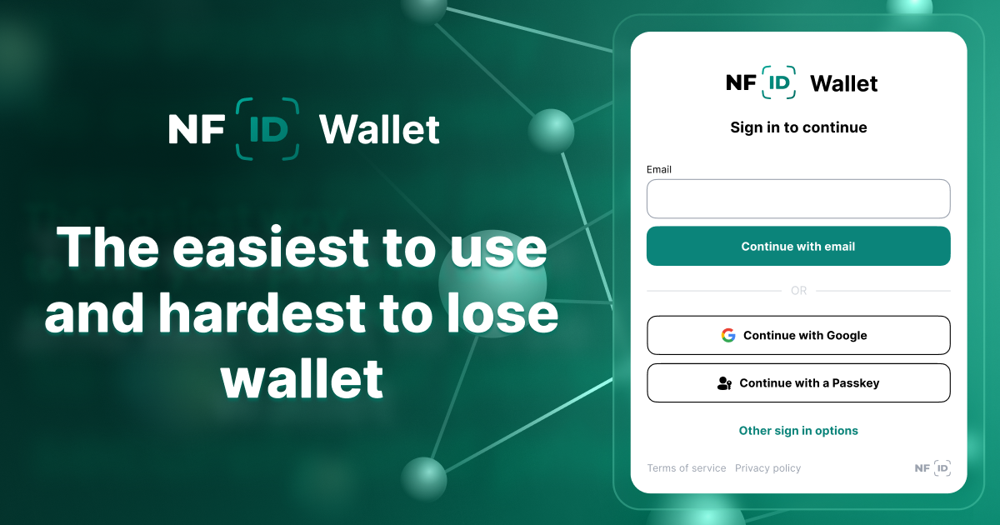

<div style="display:flex;flex-direction:column;">
  <a href="https://nfid.one/">
    
  </a>

<br/>
<br/>

Wallet frontend tests
[](https://github.com/internet-identity-labs/nfid-wallet-client/actions/workflows/desktop-tests.yml)

# NFID Wallet

NFID Wallet is a simple, secure, browser-based, soon-to-be-DAO-controlled wallet powered by the Internet Computer Protocol's [Chain Fusion](https://internetcomputer.org/chainfusion) technology.

---

## Features

### Lowest barrier to entry

NFID Wallet takes wallet creation down from minutes to seconds with:

- Email onboarding
- Browser-based accessibility
- No need for a seed phrase

Users create an NFID Wallet on any browser from any device in seconds with just an email address. Email onboarding is a managed service offered by Internet Identity Labs, and users can switch this service off by enabling "self-sovereign mode" whereby only user-owned passkeys are able to authenticate wallet access. With this mode enabled, users can bypass email authentication altogether and authenticate directly with a passkey. If users attempt to use an email address, they will be required to authenticate with a passkey anyway.

### Highest security guarantees

In contrast to centrally-controlled browser extension or mobile app wallets, NFID Wallet requires only trust in the Internet Computer Protocol:

- Fully on-chain
- Fault-tolerant access
- ICP network key custody

The NFID Wallet frontend and backend code is stored on-chain and served directly into the browser environment, making both the frontend and backend tamper-resistant against malicious actors.

Seed phrases are a single source of failure that have led to the loss of trillions of dollars of crypto. Through the use of passkeys, users can set up multiple ways of authenticating to their wallet, all of which are extremely difficult to lose or steal.

NFID Wallet leverages ICP's native threshold ECDSA (and later threshold Schnorr) feature wherein the protocol handles the key-share distribution and signature generation across ICP nodes. Read more in [DFINITY's forum post](https://forum.dfinity.org/t/threshold-ecdsa-cryptography-review-by-ncc-group-third-party-security-audit-3/13853) about NCC Group's [public audit report for this feature](https://www.nccgroup.com/us/research-blog/public-report-threshold-ecdsa-cryptography-review/).

Users have extremely high security guarantees against malicious code updates, lost logins, and lost private keys.

### Future roadmap

#### SNS DAO (complete)

In the very near future, NFID Wallet plans to commit itself to DAO control through DFINITY's SNS launchpad, after which all code updates and treasury allocations will require DAO approval.

#### Dynamic swaps (complete)

With a variety of DEXs on ICP, each with different price markets and liquidity levels, users never know where they can get the best price for their swaps. NFID Wallet plans to create a system of dynamic swaps to route one swap across multiple DEXs to get the most tokens out of the swap.

#### Native staking

Web3 thrives on openness—users connect to services while carrying their reputation across ecosystems. This interoperability has driven the success of fungible tokens, NFTs, and DeFi. Without the ability to use a consistent identity across smart contracts, this innovation wouldn’t exist.

On ICP, this seamless connectivity is still underdeveloped, contributing to lower activity. Since ICP’s genesis, for example, users have wanted to showcase their commitment by proving they’ve staked ICP in an 8-year, non-dissolving neuron. However, the absence of wallet standards and a frontend-agnostic staking platform has made this impossible.

While standards now exist, a frontend-agnostic staking platform is still missing. As the gateway to the ICP ecosystem, the wallet is the natural place to integrate staking for ICP and SNS DAOs. This feature will provide developers with a critical new building block—stake verification—to enhance their applications.

#### DeFi tab

Currently, users managing liquidity in DeFi pools must visit each DEX separately. NFID Wallet’s DeFi Tab will aggregate all LP positions in one place, making liquidity management seamless and efficient.

#### Spending cap management

Dapps like KongSwap and Waterneuron request spending approvals for tokens, leading to two key user needs:

1. Adjusting the approved spending limit.
2. Revoking permissions when needed.

This feature will allow users to easily modify or revoke token spending approvals directly within the wallet.

---

## Navigating this repository

- [What you'll find](#what-youll-find)
- [Setup Development Environment](#setup-development-environment)
  - [Prerequisites](#prerequisites)
  - [Install Dependencies](#install-dependencies)
  - [Copy Environment Configuration](#copy-environment-configuration)
  - [Run the Application](#run-the-application)
  - [Run Legacy SDK Playground (Optional)](#run-legacy-sdk-playground-optional)
- [Testing](#testing)
  - [Integration Tests](#integration-tests)
  - [E2E Tests](#e2e-tests)
- [Deployment](#deployment)
- [Architecture](#architecture)
- [Community & Support](#community--support)

---

## What you'll find

The current repository is the frontend interface for NFID Wallet, where you'll find setup, deployment, and testing instructions, as well as technical information on its architecture.

---

## Setup Development Environment

### Prerequisites

Before setting up, ensure the following are installed:

- **NodeJS** `v22.18.0`
- **Yarn** `v1.22.22`

### Install Dependencies

Install all necessary dependencies:

```bash
yarn
```

### Copy Environment Configuration

Copy the environment template:

```bash
cp .env.local.template .env.local
```

### Run the Application

Start the application locally:

```bash
npx nx serve nfid-wallet-client
```

Access the application in your browser at: [http://localhost:9090](http://localhost:9090)

### Run Legacy SDK Playground (Optional)

To run the legacy SDK playground:

```bash
npx nx serve nfid-demo
```

---

## Testing

### Integration Tests

Run integration tests with:

```bash
npx env-cmd -f .env.test nx run-many --target=test --skip-nx-cache --maxAttempts=2 --maxParallel=1
```

### E2E Tests

#### Prerequisites

Install Google Chrome for E2E tests.

#### Run the Application

To start both client and demo apps for testing:

```bash
npx nx serve nfid-wallet-client
npx nx serve nfid-demo
```

#### Run E2E Tests

Execute end-to-end tests using:

```bash
npx env-cmd -f .env.test nx test:e2e nfid-frontend-e2e
```

---

## Deployment

Deploying to the Internet Computer is managed with DFX v0.24.1. Ensure it’s installed and configured before proceeding with deployment.

---

## Architecture

This architecture is inspired by:

- **[clean-code-javascript](https://github.com/ryanmcdermott/clean-code-javascript)**
- **[bulletproof-react](https://github.com/alan2207/bulletproof-react/)**
- **[react-clean-architecture](https://github.com/eduardomoroni/react-clean-architecture)**

Each application, such as `nfid-wallet-client`, consists of `pages` that render specific URLs. Pages are assembled from components exported via our public interface in `package/features`, ensuring modularity and clean separation of concerns.

### Libraries

⚠️ New packages **MUST** undergo security audits before installation. ⚠️

- **State Management**:
  - [jotai](https://jotai.org/): for global state singletons
  - [xstate](https://xstate.js.org/): for managing complex flows
  - [rxjs](https://rxjs.dev/): to bridge vanilla JavaScript and React state

- **Client-side Caching** - [swr](https://swr.vercel.app/)
- **Forms** - [React Hook Form](https://react-hook-form.com/)
- **Routing** - [react-router-dom](https://reactrouter.com/en/main)

---

## Community & Support

Connect with the NFID Wallet community for support, updates, and discussions:

- [Discord](https://discord.gg/a9BFNrYJ99)
- [OpenChat](https://oc.app/community/66hym-7iaaa-aaaaf-bm7aa-cai/channel/1241143482/?ref=prkg5-paaaa-aaaaf-aqbia-cai)

> **Web3 is all about community!** Let’s build, support, and grow together 🚀
