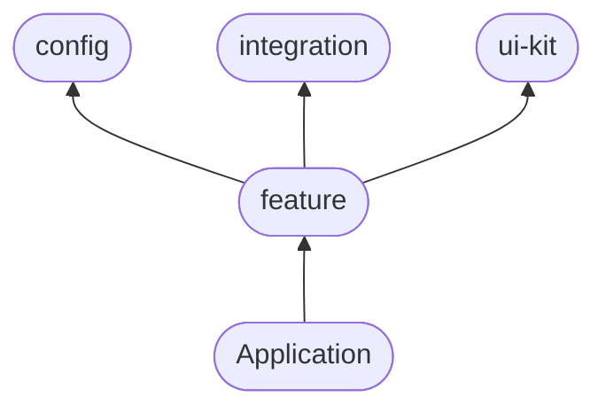

# NFID Frontend

## Setup development environment

### Install dependencies

```
yarn login --registry=https://npm.pkg.github.com --scope=@psychedelic
yarn
```

### Install latest dfx

```
sh -ci "$(curl -fsSL https://internetcomputer.org/install.sh)"
```

### Install ngrok (https tunnel for mobile device)

[download ngrok](https://dashboard.ngrok.com/get-started/setup) and unzip to `./scrips/ngrok`

setup your authtoken (copy from ngrok dashboard)

```
./scripts/ngrok authtoken <YOUR_AUTH_TOKEN>
```

### Environment config

```
cp .env.local.template .env.local
```

Update user specific `TUNNEL_DOMAIN` vairables within your local copy `.env.local`. This is the domain which should be used for the qrcode.

example

```
TUNNEL_DOMAIN=3540a630b330.ngrok.io
```

## Available scripts

when you're working with vscode you can use the task runner to start the development environment. Press `CMD+SHIFT+P` then type `run task` and select from:

1. NFID Frontend (`npx nx serve nfid-frontend`)
2. NFID Demo (`npx nx serve nfid-demo`)
3. NFID Storybook (`npx nx storybook ui`)
4. etc...

## Architecture

To build a scalable and reusable application architecture we're applying a modular approach which can be described by the following diagram:



This architecture is inspired by:

1. [clean-code-javascript](https://github.com/ryanmcdermott/clean-code-javascript)
2. [bulletproof-react](https://github.com/alan2207/bulletproof-react/)
3. [react-clean-architecture](https://github.com/eduardomoroni/react-clean-architecture)

The individual applications (e.g. `nfid-frontend`) holds a collection of `pages` rendered on specific `urls`. Each page assembles components exported from our public interface in `package/features` without referring to any lower level implementation details.

### Libraries

⚠️ new packages **MUST** undergo security audits before installation. ⚠️

**State**

currently we're relying on these state management solutions (will be revised as having so many is not ideal):

- [jotai](https://jotai.org/) to handle global state singletons
- [xstate](https://xstate.js.org/) to manage complicated flows
- [rxjs](https://rxjs.dev/) to bridge state between vanilla js to react state

**Client side caching** - [swr](https://swr.vercel.app/)

**Forms state** - [React Hook Form](https://react-hook-form.com/)

**Routing** - [react-router-dom](https://reactrouter.com/en/main)

**TODOs**

- [ ] replace [@headlessui/react](https://bundlephobia.com/package/@headlessui/react@1.7.4) with [@radix-ui](https://www.radix-ui.com/) as wrapped ui-kit components
- [ ] replace [react-awesome-reveal](https://bundlephobia.com/package/react-awesome-reveal@4.1.0) with [@react-motion](https://bundlephobia.com/package/react-motion@0.5.2) as wrapped ui-kit components
- [ ] replace [react-toastify]() [@radix-ui/react-toast](https://www.radix-ui.com/docs/primitives/components/toast#toast) as wrapped ui-kit components
- [ ] replace [react-tooltip]() with [@radix-ui/react-tooltip](https://www.radix-ui.com/docs/primitives/components/tooltip#tooltip) as wrapped ui-kit components
- [ ] replace [react-scroll-parallax](), [react-scrollspy](), [stickyfilljs]() with [react-viewport-utils](https://www.npmjs.com/package/react-viewport-utils)

### Applications within the mono repo

```
apps/
  nfid-demo/
  nfid-frontend/
  nfid-frontend-e2e/
```

### Modular application architecture

**TODOs**

- [ ] define feature scaffold
- [ ] define page scaffold
- [ ] extract/bundle components into features
- [ ] extract/bundle integration/state components into `packages/integration` and `packages/features`

```
apps/nfid-frontend/

  pages/          # connected container components
    profile/        # nfid.one/profile/ (resolves to index.ts within that folder)
      assets/         # nfid.one/profile/assets
        cmp/
        hooks/
        constants.ts    # contains constant configuration defaults
        intex.ts        # exposes public interface. Nowhere else will be exported

      applications/   # nfid.one/profile/applications
      credentials/    # nfid.one/profile/credentials
      security/       # nfid.one/profile/security
      index.ts

  flows/          # coordination layer which sticks multiple pages into a flow
    idp/

```

### Packages within the mono repo

```
packages/
  config/         # Shared configuration and constants
  integration/    # Shared api/backend integration
    _ic_api/        # generated idlFactories and types
    actors.ts       # icp interface
    index.ts        # exports public accessible interface

  utils/          # vanilly typescript helper
  react-utils/    # shared react helper
    hooks/          # shared react helper
    provider/       # shared react helper

  ui/             # Shared dumb UI components
    atoms/        # smalles building blocks e.g. button
    molecules/    # combines atoms e.g. input field with label and error component
    organisms/    # combines molecules e.g search field with icon input field and button
    templates/    # full reusable page templates/layouts

  features/       # modular main feature integrated on multiple pages
    authentication/
    authorization/
    account-recovery/
    authorized-devices/
    applications/
    nfts/
    phone-number-credential/
    send-receive-icp/
```
