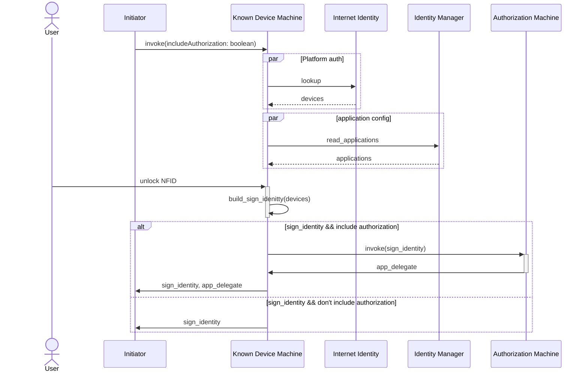

# Known Device Machine

[Authorization Machine](../authorization.md)

## Initiators

[Authentication Machine](./.root)

```mermaid
sequenceDiagram

  actor User
  participant IN as Initiator
  participant KD as Known Device Machine
  participant II as Internet Identity
  participant IM as Identity Manager
  participant AM as Authorization Machine

  IN->>KD: invoke(includeAuthorization: boolean)
  par Platform auth
    KD->>II: lookup
    II-->>KD: devices
  end
  par application config
    KD->>IM: read_applications
    IM-->>KD: applications
  end

  User->>+KD: unlock NFID
  KD->>-KD: build_sign_idenitty(devices)

  alt sign_identity && include authorization
    KD->>+AM: invoke(sign_identity)
    AM->>-KD: app_delegate
    KD->>IN: sign_identity, app_delegate
  else sign_identity && don't include authorization
    KD->>IN: sign_identity
  end
```
