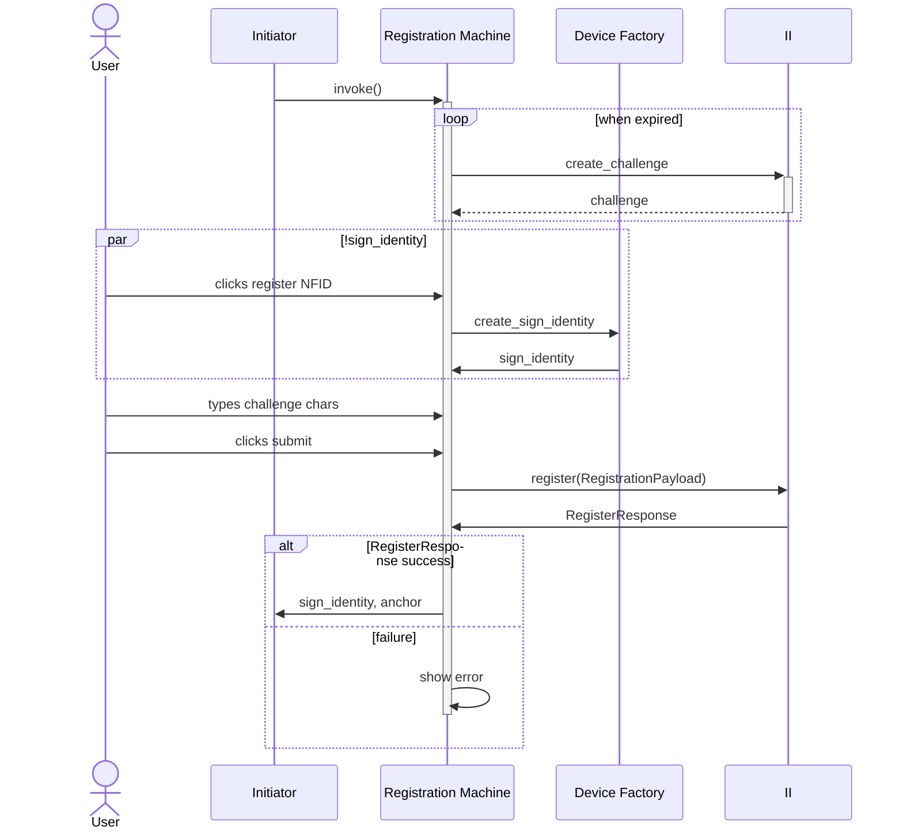

# Navigation

**Registration Machine**

## Initiators

[Unknown Device Machine](../authentication/unknown-device.md)

```mermaid
sequenceDiagram

    actor User
    participant Initiator
    participant Registration Machine
    participant Device Factory
    participant II

    Initiator->>+Registration Machine: invoke()

    loop when expired
      Registration Machine->>+II: create_challenge
      II-->>-Registration Machine: challenge
    end

    par !sign_identity
      User->>Registration Machine: clicks register NFID
      Registration Machine->>Device Factory: create_sign_identity
      Device Factory->>Registration Machine: sign_identity
    end

    User->>Registration Machine: types challenge chars
    User->>Registration Machine: clicks submit

    Registration Machine->>II: register(RegistrationPayload)
    II->>Registration Machine: RegisterResponse

    alt RegisterResponse success
      Registration Machine->>Initiator: sign_identity, anchor
    else failure
      Registration Machine->>-Registration Machine: show error
    end

```
