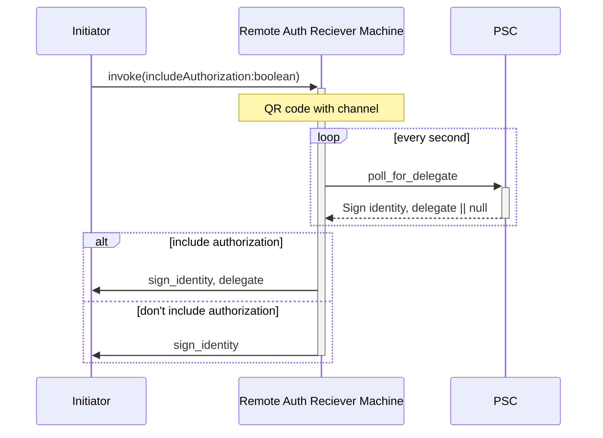

# Remote Auth Receiver

## Initiators

[Unknown Device](./unknown-device.md)

```mermaid
sequenceDiagram

    participant Initiator
    participant Remote Auth Reciever Machine
    participant PSC

    Initiator->>+Remote Auth Reciever Machine: invoke(includeAuthorization:boolean)
    note over Remote Auth Reciever Machine: QR code with channel

    loop every second
      Remote Auth Reciever Machine->>+PSC: poll_for_delegate
      PSC-->>-Remote Auth Reciever Machine: Sign identity, delegate || null
    end

    alt include authorization
      Remote Auth Reciever Machine->>Initiator: sign_identity, delegate
    else don't include authorization
      Remote Auth Reciever Machine->>-Initiator: sign_identity
    end
```
