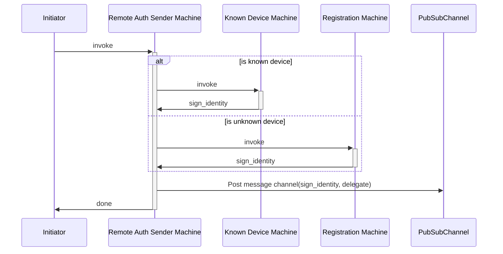

# Remote Auth Sender

[Known Device Machine](./known-device.md)

[Registration Machine](../registration/registration.md)

## Initiators

[Remote Auth Receiver](./remote-auth-receiver.md)

```mermaid
sequenceDiagram

  participant IN as Initiator
  participant RASM as Remote Auth Sender Machine
  participant KDM as Known Device Machine
  participant RM as Registration Machine
  participant PSC as PubSubChannel

  IN->>+RASM: invoke
  alt is known device
    RASM->>+KDM: invoke
    KDM->>-RASM: sign_identity
  else is unknown device
    RASM->>+RM: invoke
    RM->>-RASM: sign_identity
  end

  RASM->>PSC: Post message channel(sign_identity, delegate)

  RASM->>-IN: done
```
