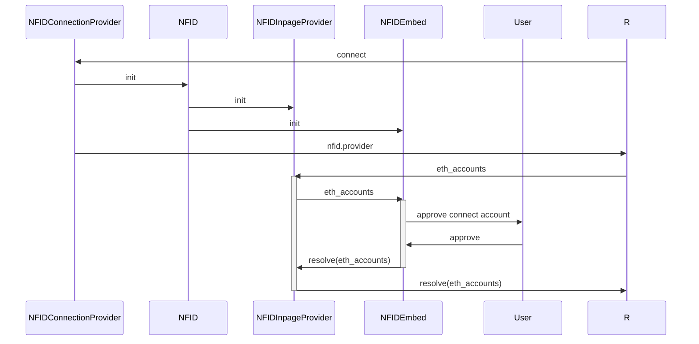

# NFID Embed

## Ethereum Wallet

```mermaid
sequenceDiagram

    participant NCP as NFIDConnectionProvider
    participant NFID as NFID
    participant NFIDP as NFIDInpageProvider
    participant NFIDI as NFIDEmbed
    participant U as User

    R->> NCP: connect
    NCP ->> NFID : init
    NFID ->> NFIDP : init
    NFID ->> NFIDI : init
    NCP->> R: nfid.provider
    R->> NFIDP: eth_accounts
    activate NFIDP
    NFIDP ->> NFIDI: eth_accounts
    activate NFIDI
    NFIDI ->> U: approve connect account
    U ->> NFIDI: approve
    NFIDI ->> NFIDP: resolve(eth_accounts)
    deactivate NFIDI
    NFIDP ->> R: resolve(eth_accounts)
    deactivate NFIDP
```

### NFID Provider Proxy

case switch
