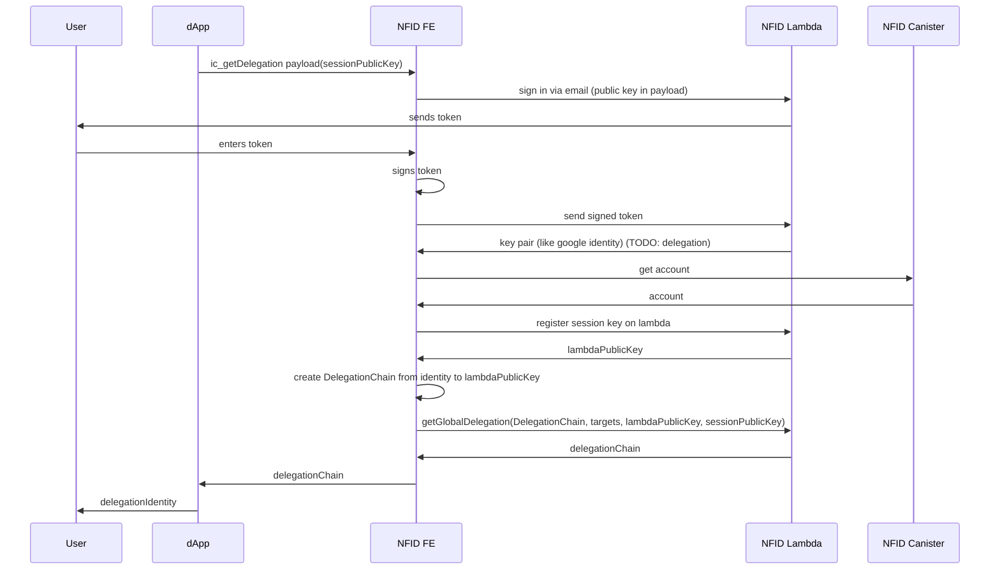
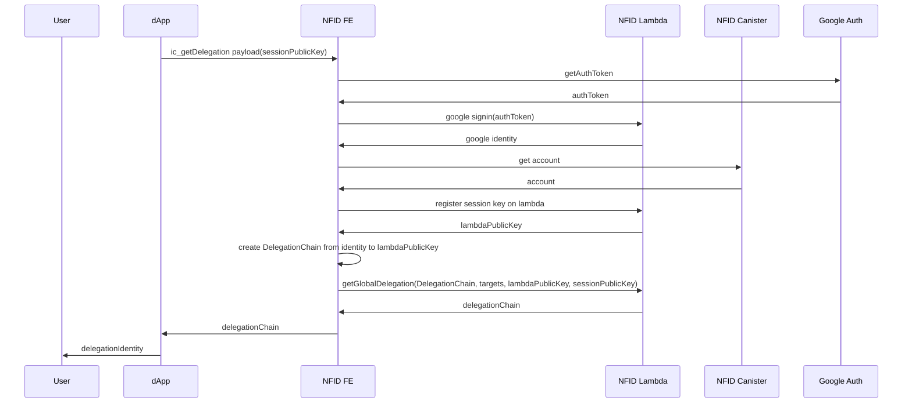

# Current

## Sign in with email

```mermaid
sequenceDiagram

    participant A as User
    participant B as dApp
    participant C as NFID FE
    participant D as NFID Lambda
    participant E as NFID Canister

    B->>C: ic_getDelegation payload(sessionPublicKey)
    C->>D: sign in via email (public key in payload)
    D->>A: sends token
    A->>C: enters token
    C->>C: signs token
    C->>D: send signed token
    D->>C: key pair (like google identity) (TODO: delegation)
    C->>E: get account
    E->>C: account
    C->>D: register session key on lambda
    D->>C: lambdaPublicKey
    C->>C: create DelegationChain from identity to lambdaPublicKey
    C->>D: getGlobalDelegation(DelegationChain, targets, lambdaPublicKey, sessionPublicKey)
    D->>C: delegationChain
    C->>B: delegationChain
    B->>A: delegationIdentity
```

## Sign in with Google

```mermaid
sequenceDiagram

    participant A as User
    participant B as dApp
    participant C as NFID FE
    participant D as NFID Lambda
    participant E as NFID Canister
    participant F as Google Auth

    B->>C: ic_getDelegation payload(sessionPublicKey)
    C->>F: getAuthToken
    F->>C: authToken
    C->>D: google signin(authToken)
    D->>C: google identity
    C->>E: get account
    E->>C: account
    C->>D: register session key on lambda
    D->>C: lambdaPublicKey
    C->>C: create DelegationChain from identity to lambdaPublicKey
    C->>D: getGlobalDelegation(DelegationChain, targets, lambdaPublicKey, sessionPublicKey)
    D->>C: delegationChain
    C->>B: delegationChain
    B->>A: delegationIdentity
```
