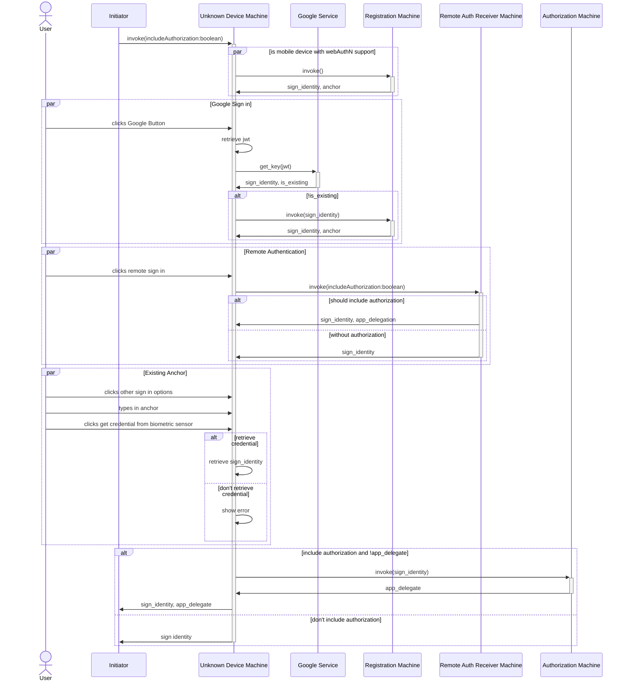

# Unknown Device Machine

[Registration Machine](../registration/registration.md)

[Remote Auth Receiver](./remote-auth-receiver.md)

[Authorization Machine](../authorization.md)

## Initiators

[Authentication Machine](./.root.md)

