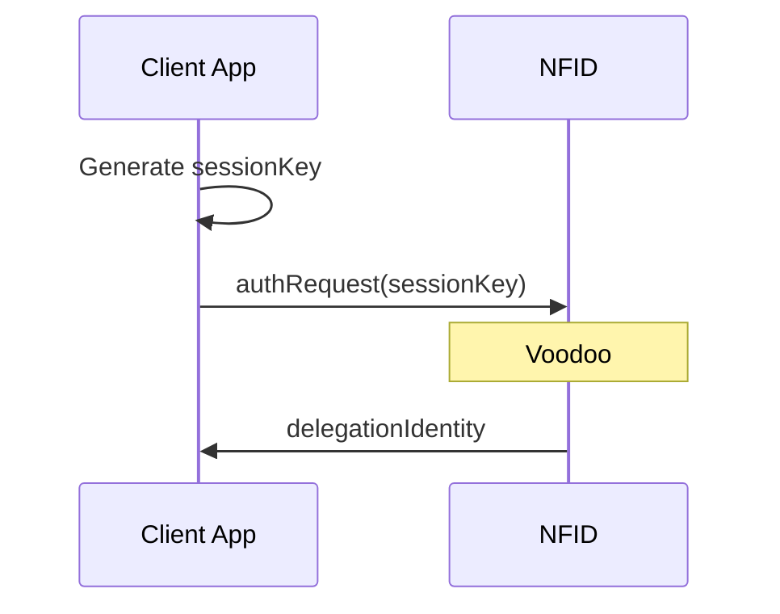
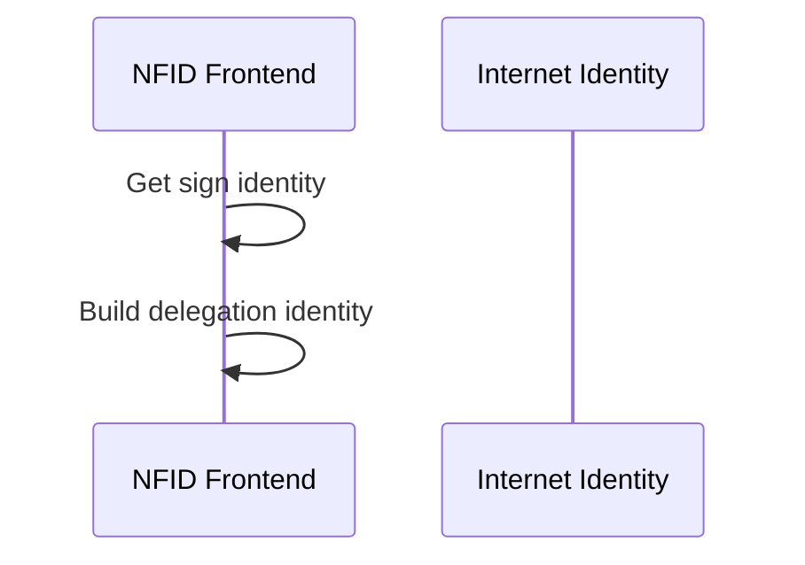

# Identity Provider Delegation Chain Creation

Let's take a look at what exactly we construct and send to an application that requests to "connect via NFID."

First, the client creates a key pair that will act as the session identity. This `sessionKey` is passed to NFID which then builds—if the user consents—a "delegation chain" that grants this `sessionKey` temporary signing authority on behalf of the user's NFID.

The resulting "delegation identity" can then by used by the connected dapp to send messages to canisters on the user's behalf until it expires. Note that apps always receive a scoped delegation (i.e. unique principals for every connecting domain.)

Pretty simple so far: we send some session keys, and if the user permits it, NFID sends us back some keys that allow us to sign messages on the user's behalf.

Let's look deeper.

## Authenticating The User

The first step in building a delegation identity for the client app is to authenticate the user. NFID supports several authentication paths, but they all result in the same thing: a "sign identity" which represents a key pair with authority over an internet identity anchor.

Let's examine the simplest authentication path, where the user authenticates to an existing anchor using the current device. After understanding this path, all others are just variations on the same basic concepts.

### Local Device Authentication

First, we generate a session key pair which will act as a "session identity" that we can use to interact with the NFID and Internet Identity canisters that we need in order to build our delegation for the third party app.

With these keys in hand, we need

It can be confusing that there are multiple sets of session keys and delegation identities created in this flow, but while they are the same data structures, they have very different content.
